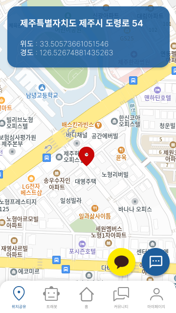
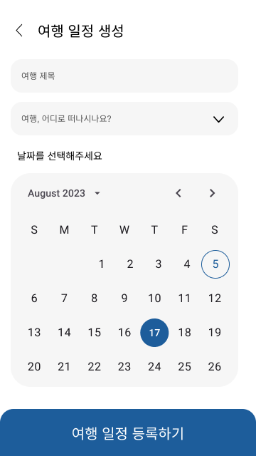
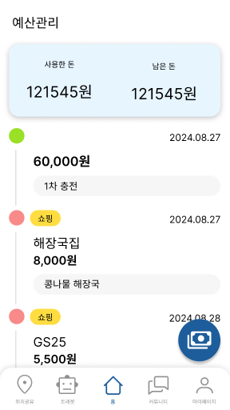
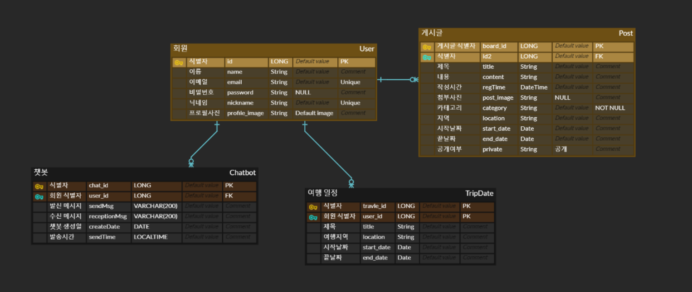

# 나혼자 트래블

 

> 혼자 여행하는 사람들을 위한 혁신적인 앱, 나혼자 트래블

## 📱 Screenshots

| | | | | | |
|-|-|-|-|-|-|
|  |  |  |   | |  |

## 🏢 ERD (Entity-Relationship Diagram)

## ⚙️ Prerequisites
'나혼자트래블' 앱을 개발하기 위해 필요한 도구입니다.

- Android Studio Koala (2024.1.1)
    - https://developer.android.com/studio
    - https://android-developers.googleblog.com/2022/09/android-studio-dolphin.html
- Android SDK 33
    - https://developer.android.com/about/versions/13/setup-sdk
- Java 17
    - https://adoptium.net/temurin/releases/?version=17
- Kakao OAuth
    - https://developers.kakao.com/docs/latest/ko/kakaologin/rest-api
- OpenAI API
    - https://openai.com/chatgpt

## 🙋 Contributors

|  |  |  |  |
|:-----------------------------------------------------------------------------:|:-----------------------------------------------------------------------------:|:-----------------------------------------------------------------------------:|:-----------------------------------------------------------------------------:|
| [구혜승](https://github.com/GOOHAESEUNG)                                      | [김채민](https://github.com/zen0113)                                          | [이호연](https://github.com/howooyeon)                                        | [한다은](https://github.com/)                                                 |
          
